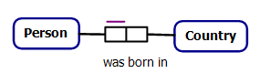
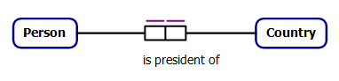
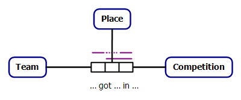
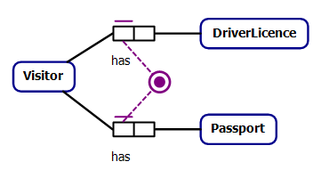
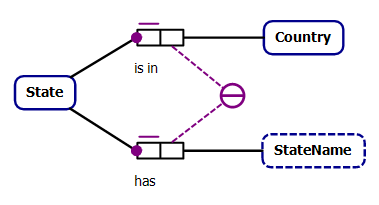

Examples from the ORM [glossary](http://www.orm.net/pdf/ORMsyntax-semantics-glossary.pdf),
adapted to SHACL shapes.

## Uniqueness constraints on a binary fact type



Each Person was born in at most one Country.

```turtle
<UC1> sh:targetClass ex:Person ;
    sh:property [
        sh:path ex:wasBornIn ;
        sh:maxCount 1 ;
        sh:class ex:County ;
    ] .
```



 Each Person is president of at most one Country

```turtle
<UC2#a> sh:targetClass ex:Person ;
    sh:property [
        sh:path ex:isPresidentOf ;
        sh:maxCount 1 ;
        sh:class ex:County ;
    ]  .
```
 For each Country, at most one Person is president of that Country
```turtle
<UC2#b> sh:targetClass ex:Country ;
    sh:property [
        sh:path [ sh:inversePath ex:isPresidentOf ];
        sh:maxCount 1 ;
        sh:class ex:Person ;
    ]  .
```

## Uniqueness constraints on a ternary fact type



There are various [patterns](https://www.w3.org/TR/swbp-n-aryRelations/) to represent n-ary relations in RDF. Assuming the representation [with no distinguished participant](https://www.w3.org/TR/swbp-n-aryRelations/#useCase3):

```turtle
[
    a ex:Placement ;
    ex:team <team1> ;
    ex:competition <competition1> ;
    ex:place <place1> ;
] .
```


For each Team and Competition, that Team got at most one Place in that Competition.

(It is impossible that for some Team and Competition, that Team got more than one Place in that Competition)


```turtle
<UC3#a> sh:targetClass ex:Placement ;
	sh:sparql [
		sh:prefixes ex: ;
		sh:select """
			SELECT $this
			WHERE {
                $this a ex:Placement ; 
                    ex:team ?team ;
                    ex:competition ?competition ; 
                    ex:place ?place1 .
                ?other a ex:Placement ; 
                    ex:team ?team ;
                    ex:competition ?competition ;
                    ex:place ?place2 .
                FILTER (?place1 != ?place2)
			}
			""" ;
	] .
```

For each Place and Competition, at most one Team got that Place in that Competition.

(It is impossible that for some Place and Competition, more than one Team got that Place in that Competition).


```turtle
<UC3#b> sh:targetClass ex:Placement ;
	sh:sparql [
		sh:prefixes ex: ;
		sh:select """
			SELECT $this
			WHERE {
                $this a ex:Placement ; 
                    ex:place ?place ;
                    ex:competition ?competition ; 
                    ex:team ?team1 .
                ?other a ex:Placement ; 
                    ex:place ?place ;
                    ex:competition ?competition ;
                    ex:team ?team2 .
                FILTER (?team1 != ?team2)
			}
			""" ;
	] .
```

## Simple mandatory role constraint


Each Person was born in some Country

```turtle
<UC4> sh:targetClass ex:Person ;
    sh:property [
        sh:path ex:wasBornIn ;
        sh:minCount 1 ;
        sh:class ex:County ;
    ] 
.
```

## Inclusive-or constraint



Each Visitor has some DriverLicence or has some Passport.

```turtle
<InclOR> sh:targetClass ex:Visitor ;
    sh:property [
        sh:path [ sh:alternativePath (ex:hasDriverLicence ex:hasPassport) ] ;
        sh:minCount 1 ;
    ]
.
```

## External uniqueness constraint


For each Country and StateName, at most one State is in that Country and has that StateName. 


```turtle
<UExt> sh:targetClass ex:State ;
   sh:sparql [
		sh:prefixes ex: ;
		sh:select """
			SELECT $this
			WHERE {
                $this a ex:State ; 
                    ex:isIn ?country ;
                    ex:hasStateName ?stateName .
                ?other a ex:State ; 
                    ex:isIn ?country ;
                    ex:hasStateName ?stateName .
                FILTER ($this != ?other)
			}
			""" ;
	] .
.
```

## Object type value constraint

## Role value constraint

## Subset constraint

## Join subset constraint

## Exclusion constraint

## Equality constraint

## Subtyping constraints

## Internal frequency constraint

## External frequency constraint

## Value-comparison constraint

## Ring constraints